# ER DIAGRAMS

**University Higher Education ERP System** — M7 BATCH, Department of E&TCE

Eight diagrams: one **global** diagram showing how the seven modules share the same student,
faculty and department masters, plus one diagram per module.

| # | Diagram | SVG | Entities | Relationships |
|---|---|---|---|---|
| 0 | University ERP — Global ER diagram | [`er_global.svg`](er/er_global.svg) | 35 | 46 |
| 1 | Module 1 — Student & Admission | [`er_module1_student_admission.svg`](er/er_module1_student_admission.svg) | 12 | 13 |
| 2 | Module 2 — Academic & Course | [`er_module2_academic_course.svg`](er/er_module2_academic_course.svg) | 12 | 14 |
| 3 | Module 3 — Attendance | [`er_module3_attendance.svg`](er/er_module3_attendance.svg) | 8 | 9 |
| 4 | Module 4 — Examination & Results | [`er_module4_examination_results.svg`](er/er_module4_examination_results.svg) | 9 | 10 |
| 5 | Module 5 — Fees & Finance | [`er_module5_fees_finance.svg`](er/er_module5_fees_finance.svg) | 10 | 10 |
| 6 | Module 6 — Hostel | [`er_module6_hostel.svg`](er/er_module6_hostel.svg) | 10 | 12 |
| 7 | Module 7 — Faculty, Leave & Payroll | [`er_module7_faculty_leave_payroll.svg`](er/er_module7_faculty_leave_payroll.svg) | 11 | 12 |

Every picture below is produced by `scripts/generate_er_diagrams.py`, so the SVG and the Mermaid
source can never disagree. Regenerate everything with:

```bash
python3 scripts/generate_er_diagrams.py
```

## Notation

| Symbol | Meaning |
|---|---|
| `# column` | Primary key |
| `~ column` | Foreign key |
| `1--` | One — a single tick on the relationship line |
| crow's foot | Many |
| `- - -` | Derived / identifying relationship (enforced by a trigger or exposed by a view) |

## How the modules are joined

* `users` is the single authentication table; `students` and `faculty` each carry a `user_id`, so a person is
  never duplicated across modules.
* `departments`, `programs`, `batches`, `sections` and `subjects` are shared masters used by academics,
  attendance, examinations, fees and faculty alike.
* `students` is referenced by admissions, enrolments, attendance, exam registrations, marks, results, fees,
  hostel applications/allocations and the analytics tables — that is what makes this one ERP instead of
  seven disconnected apps.
* `course_offerings` is the pivot of the academic side: attendance sessions, exam registrations, timetable
  slots and enrolments all hang off it.

---

## University ERP — Global ER diagram

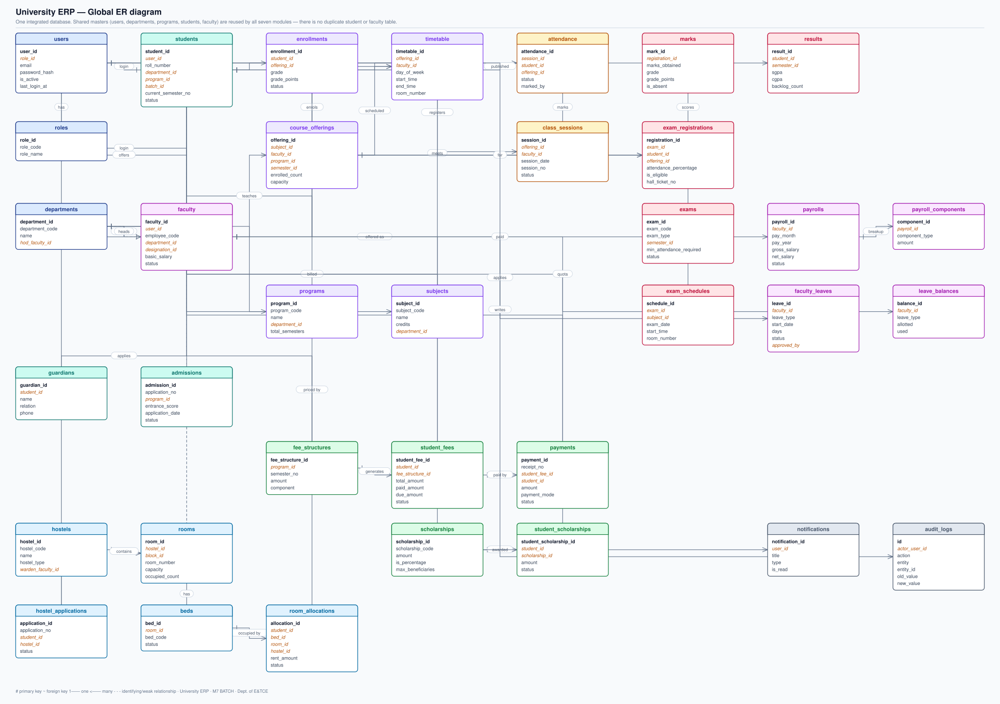

_One integrated database. Shared masters (users, departments, programs, students, faculty) are reused by all seven modules — there is no duplicate student or faculty table._

<details><summary>Mermaid source (paste into any Mermaid renderer)</summary>


```mermaid
erDiagram
    USERS {
        string user_id PK
        string role_id FK
        string email
        string password_hash
        string is_active
        date last_login_at
    }
    ROLES {
        string role_id PK
        string role_code
        string role_name
    }
    DEPARTMENTS {
        string department_id PK
        string department_code
        string name
        string hod_faculty_id FK
    }
    STUDENTS {
        string student_id PK
        string user_id FK
        string roll_number
        string department_id FK
        string program_id FK
        string batch_id FK
        decimal current_semester_no
        string status
    }
    FACULTY {
        string faculty_id PK
        string user_id FK
        string employee_code
        string department_id FK
        string designation_id FK
        decimal basic_salary
        string status
    }
    PROGRAMS {
        string program_id PK
        string program_code
        string name
        string department_id FK
        string total_semesters
    }
    SUBJECTS {
        string subject_id PK
        string subject_code
        string name
        string credits
        string department_id FK
    }
    COURSE_OFFERINGS {
        string offering_id PK
        string subject_id FK
        string faculty_id FK
        string program_id FK
        string semester_id FK
        int enrolled_count
        string capacity
    }
    ENROLLMENTS {
        string enrollment_id PK
        string student_id FK
        string offering_id FK
        string grade
        decimal grade_points
        string status
    }
    TIMETABLE {
        string timetable_id PK
        string offering_id FK
        string faculty_id FK
        string day_of_week
        string start_time
        string end_time
        string room_number
    }
    ADMISSIONS {
        string admission_id PK
        int application_no
        string program_id FK
        string entrance_score
        date application_date
        string status
    }
    GUARDIANS {
        string guardian_id PK
        string student_id FK
        string name
        string relation
        string phone
    }
    CLASS_SESSIONS {
        string session_id PK
        string offering_id FK
        string faculty_id FK
        date session_date
        int session_no
        string status
    }
    ATTENDANCE {
        string attendance_id PK
        string session_id FK
        string student_id FK
        string offering_id FK
        string status
        string marked_by
    }
    EXAMS {
        string exam_id PK
        string exam_code
        string exam_type
        string semester_id FK
        string min_attendance_required
        string status
    }
    EXAM_SCHEDULES {
        string schedule_id PK
        string exam_id FK
        string subject_id FK
        date exam_date
        string start_time
        string room_number
    }
    EXAM_REGISTRATIONS {
        string registration_id PK
        string exam_id FK
        string student_id FK
        string offering_id FK
        decimal attendance_percentage
        string is_eligible
        int hall_ticket_no
    }
    MARKS {
        string mark_id PK
        string registration_id FK
        string marks_obtained
        string grade
        decimal grade_points
        string is_absent
    }
    RESULTS {
        string result_id PK
        string student_id FK
        string semester_id FK
        decimal sgpa
        decimal cgpa
        int backlog_count
    }
    FEE_STRUCTURES {
        string fee_structure_id PK
        string program_id FK
        int semester_no
        decimal amount
        string component
    }
    STUDENT_FEES {
        string student_fee_id PK
        string student_id FK
        string fee_structure_id FK
        decimal total_amount
        decimal paid_amount
        decimal due_amount
        string status
    }
    PAYMENTS {
        string payment_id PK
        int receipt_no
        string student_fee_id FK
        string student_id FK
        decimal amount
        string payment_mode
        string status
    }
    SCHOLARSHIPS {
        string scholarship_id PK
        string scholarship_code
        decimal amount
        decimal is_percentage
        string max_beneficiaries
    }
    STUDENT_SCHOLARSHIPS {
        string student_scholarship_id PK
        string student_id FK
        string scholarship_id FK
        decimal amount
        string status
    }
    HOSTELS {
        string hostel_id PK
        string hostel_code
        string name
        string hostel_type
        string warden_faculty_id FK
    }
    ROOMS {
        string room_id PK
        string hostel_id FK
        string block_id FK
        string room_number
        string capacity
        int occupied_count
    }
    BEDS {
        string bed_id PK
        string room_id FK
        string bed_code
        string status
    }
    HOSTEL_APPLICATIONS {
        string application_id PK
        int application_no
        string student_id FK
        string hostel_id FK
        string status
    }
    ROOM_ALLOCATIONS {
        string allocation_id PK
        string student_id FK
        string bed_id FK
        string room_id FK
        string hostel_id FK
        decimal rent_amount
        string status
    }
    FACULTY_LEAVES {
        string leave_id PK
        string faculty_id FK
        string leave_type
        date start_date
        int days
        string status
        string approved_by FK
    }
    LEAVE_BALANCES {
        string balance_id PK
        string faculty_id FK
        string leave_type
        string allotted
        string used
    }
    PAYROLLS {
        string payroll_id PK
        string faculty_id FK
        string pay_month
        date pay_year
        decimal gross_salary
        decimal net_salary
        string status
    }
    PAYROLL_COMPONENTS {
        string component_id PK
        string payroll_id FK
        string component_type
        decimal amount
    }
    NOTIFICATIONS {
        string notification_id PK
        string user_id FK
        string title
        string type
        string is_read
    }
    AUDIT_LOGS {
        string id PK
        string actor_user_id FK
        string action
        string entity
        int entity_id
        string old_value
        string new_value
    }
    ROLES ||--o{ USERS : "has"
    USERS ||--|| STUDENTS : "login"
    USERS ||--|| FACULTY : "login"
    DEPARTMENTS ||--o{ STUDENTS : "offers"
    DEPARTMENTS ||--o{ PROGRAMS : "relates to"
    DEPARTMENTS ||--o{ SUBJECTS : "relates to"
    DEPARTMENTS ||--o{ FACULTY : "employs"
    FACULTY ||--|| DEPARTMENTS : "heads"
    STUDENTS ||--|| ADMISSIONS : "admitted via"
    STUDENTS ||--o{ GUARDIANS : "relates to"
    PROGRAMS ||--o{ STUDENTS : "relates to"
    PROGRAMS ||--o{ FEE_STRUCTURES : "priced by"
    SUBJECTS ||--o{ COURSE_OFFERINGS : "offered as"
    FACULTY ||--o{ COURSE_OFFERINGS : "teaches"
    COURSE_OFFERINGS ||--o{ ENROLLMENTS : "enrols"
    STUDENTS ||--o{ ENROLLMENTS : "relates to"
    COURSE_OFFERINGS ||--o{ TIMETABLE : "scheduled"
    FACULTY ||--o{ TIMETABLE : "relates to"
    COURSE_OFFERINGS ||--o{ CLASS_SESSIONS : "meets"
    CLASS_SESSIONS ||--o{ ATTENDANCE : "marks"
    STUDENTS ||--o{ ATTENDANCE : "relates to"
    STUDENTS ||--o{ EXAM_REGISTRATIONS : "registers"
    EXAMS ||--o{ EXAM_REGISTRATIONS : "relates to"
    EXAMS ||--o{ EXAM_SCHEDULES : "relates to"
    COURSE_OFFERINGS ||--o{ EXAM_REGISTRATIONS : "for"
    EXAM_REGISTRATIONS ||--|| MARKS : "scores"
    STUDENTS ||--o{ RESULTS : "published"
    STUDENTS ||--o{ STUDENT_FEES : "billed"
    FEE_STRUCTURES ||--o{ STUDENT_FEES : "generates"
    STUDENT_FEES ||--o{ PAYMENTS : "paid by"
    STUDENTS ||--o{ PAYMENTS : "relates to"
    SCHOLARSHIPS ||--o{ STUDENT_SCHOLARSHIPS : "awarded"
    STUDENTS ||--o{ STUDENT_SCHOLARSHIPS : "relates to"
    STUDENTS ||--o{ HOSTEL_APPLICATIONS : "applies"
    HOSTELS ||--o{ HOSTEL_APPLICATIONS : "relates to"
    HOSTELS ||--o{ ROOMS : "contains"
    ROOMS ||--o{ BEDS : "has"
    BEDS ||--o{ ROOM_ALLOCATIONS : "occupied by"
    STUDENTS ||--o{ ROOM_ALLOCATIONS : "relates to"
    FACULTY ||--|| ROOMS : "warden"
    FACULTY ||--o{ FACULTY_LEAVES : "applies"
    FACULTY ||--o{ LEAVE_BALANCES : "quota"
    FACULTY ||--o{ PAYROLLS : "paid"
    PAYROLLS ||--o{ PAYROLL_COMPONENTS : "breakup"
    USERS ||--o{ NOTIFICATIONS : "receives"
    USERS ||--o{ AUDIT_LOGS : "writes"
```
</details>

## Module 1 — Student & Admission

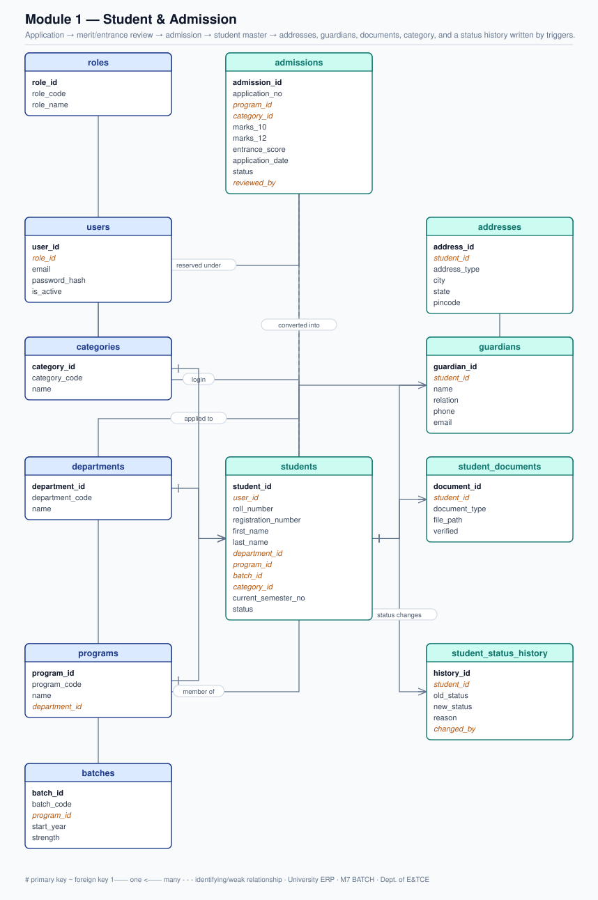

_Application → merit/entrance review → admission → student master → addresses, guardians, documents, category, and a status history written by triggers._

<details><summary>Mermaid source (paste into any Mermaid renderer)</summary>

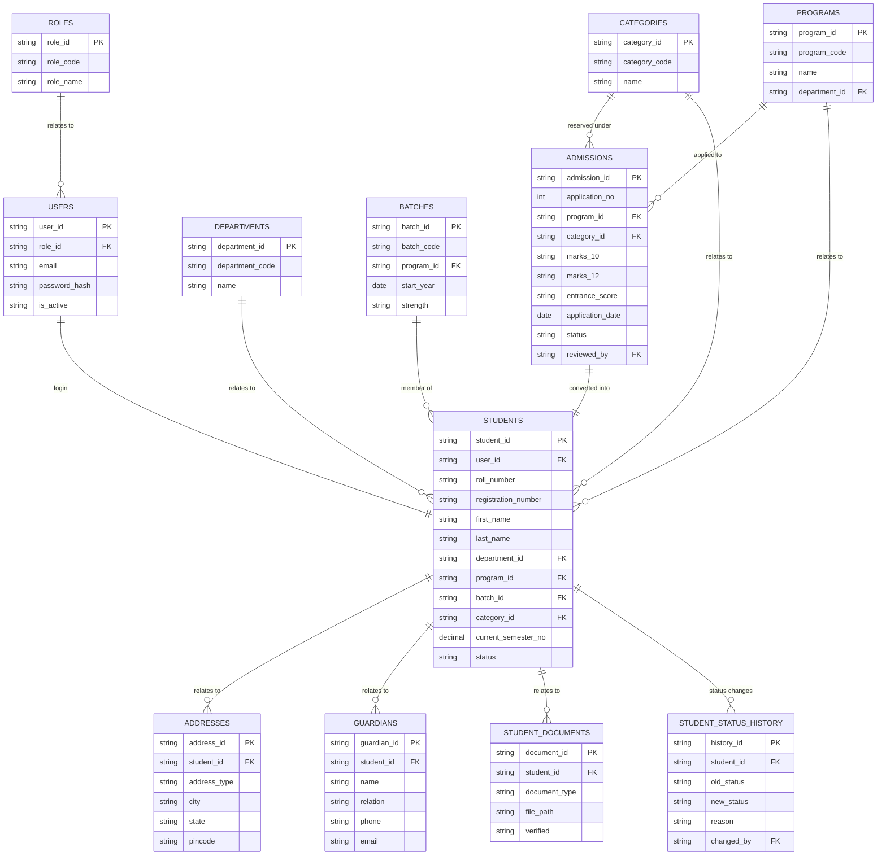
```mermaid
erDiagram
    ROLES {
        string role_id PK
        string role_code
        string role_name
    }
    USERS {
        string user_id PK
        string role_id FK
        string email
        string password_hash
        string is_active
    }
    CATEGORIES {
        string category_id PK
        string category_code
        string name
    }
    DEPARTMENTS {
        string department_id PK
        string department_code
        string name
    }
    PROGRAMS {
        string program_id PK
        string program_code
        string name
        string department_id FK
    }
    BATCHES {
        string batch_id PK
        string batch_code
        string program_id FK
        date start_year
        string strength
    }
    ADMISSIONS {
        string admission_id PK
        int application_no
        string program_id FK
        string category_id FK
        string marks_10
        string marks_12
        string entrance_score
        date application_date
        string status
        string reviewed_by FK
    }
    STUDENTS {
        string student_id PK
        string user_id FK
        string roll_number
        string registration_number
        string first_name
        string last_name
        string department_id FK
        string program_id FK
        string batch_id FK
        string category_id FK
        decimal current_semester_no
        string status
    }
    ADDRESSES {
        string address_id PK
        string student_id FK
        string address_type
        string city
        string state
        string pincode
    }
    GUARDIANS {
        string guardian_id PK
        string student_id FK
        string name
        string relation
        string phone
        string email
    }
    STUDENT_DOCUMENTS {
        string document_id PK
        string student_id FK
        string document_type
        string file_path
        string verified
    }
    STUDENT_STATUS_HISTORY {
        string history_id PK
        string student_id FK
        string old_status
        string new_status
        string reason
        string changed_by FK
    }
    ROLES ||--o{ USERS : "relates to"
    USERS ||--|| STUDENTS : "login"
    CATEGORIES ||--o{ ADMISSIONS : "reserved under"
    PROGRAMS ||--o{ ADMISSIONS : "applied to"
    ADMISSIONS ||--|| STUDENTS : "converted into"
    DEPARTMENTS ||--o{ STUDENTS : "relates to"
    PROGRAMS ||--o{ STUDENTS : "relates to"
    BATCHES ||--o{ STUDENTS : "member of"
    CATEGORIES ||--o{ STUDENTS : "relates to"
    STUDENTS ||--o{ ADDRESSES : "relates to"
    STUDENTS ||--o{ GUARDIANS : "relates to"
    STUDENTS ||--o{ STUDENT_DOCUMENTS : "relates to"
    STUDENTS ||--o{ STUDENT_STATUS_HISTORY : "status changes"
```
</details>

## Module 2 — Academic & Course

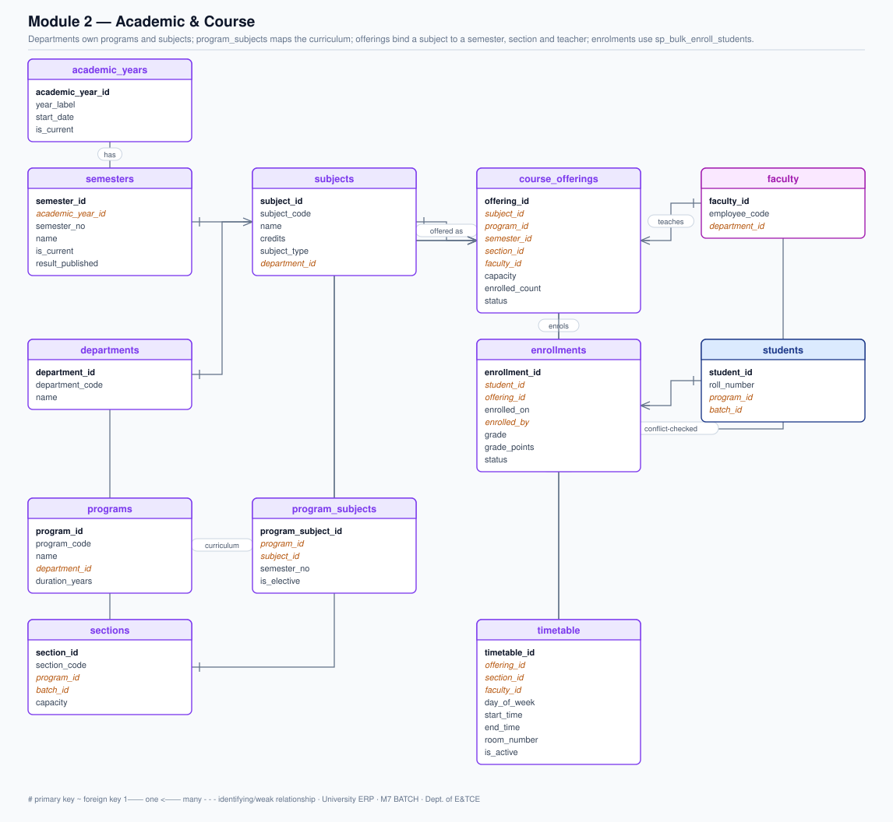

_Departments own programs and subjects; program_subjects maps the curriculum; offerings bind a subject to a semester, section and teacher; enrolments use sp_bulk_enroll_students._

<details><summary>Mermaid source (paste into any Mermaid renderer)</summary>

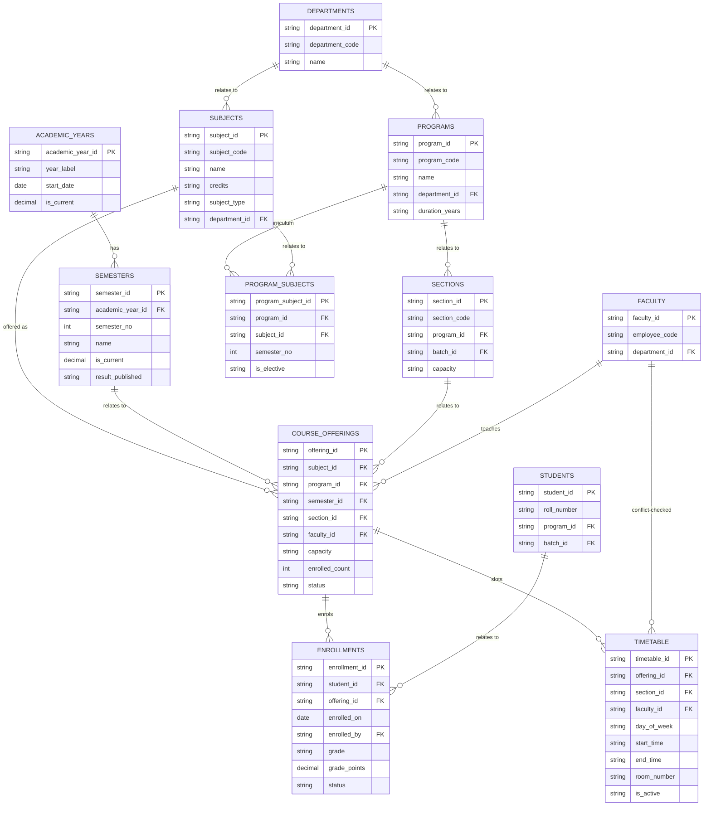
```mermaid
erDiagram
    ACADEMIC_YEARS {
        string academic_year_id PK
        string year_label
        date start_date
        decimal is_current
    }
    SEMESTERS {
        string semester_id PK
        string academic_year_id FK
        int semester_no
        string name
        decimal is_current
        string result_published
    }
    DEPARTMENTS {
        string department_id PK
        string department_code
        string name
    }
    PROGRAMS {
        string program_id PK
        string program_code
        string name
        string department_id FK
        string duration_years
    }
    SECTIONS {
        string section_id PK
        string section_code
        string program_id FK
        string batch_id FK
        string capacity
    }
    SUBJECTS {
        string subject_id PK
        string subject_code
        string name
        string credits
        string subject_type
        string department_id FK
    }
    PROGRAM_SUBJECTS {
        string program_subject_id PK
        string program_id FK
        string subject_id FK
        int semester_no
        string is_elective
    }
    COURSE_OFFERINGS {
        string offering_id PK
        string subject_id FK
        string program_id FK
        string semester_id FK
        string section_id FK
        string faculty_id FK
        string capacity
        int enrolled_count
        string status
    }
    ENROLLMENTS {
        string enrollment_id PK
        string student_id FK
        string offering_id FK
        date enrolled_on
        string enrolled_by FK
        string grade
        decimal grade_points
        string status
    }
    TIMETABLE {
        string timetable_id PK
        string offering_id FK
        string section_id FK
        string faculty_id FK
        string day_of_week
        string start_time
        string end_time
        string room_number
        string is_active
    }
    STUDENTS {
        string student_id PK
        string roll_number
        string program_id FK
        string batch_id FK
    }
    FACULTY {
        string faculty_id PK
        string employee_code
        string department_id FK
    }
    ACADEMIC_YEARS ||--o{ SEMESTERS : "has"
    DEPARTMENTS ||--o{ PROGRAMS : "relates to"
    DEPARTMENTS ||--o{ SUBJECTS : "relates to"
    PROGRAMS ||--o{ PROGRAM_SUBJECTS : "curriculum"
    SUBJECTS ||--o{ PROGRAM_SUBJECTS : "relates to"
    PROGRAMS ||--o{ SECTIONS : "relates to"
    SUBJECTS ||--o{ COURSE_OFFERINGS : "offered as"
    SEMESTERS ||--o{ COURSE_OFFERINGS : "relates to"
    SECTIONS ||--o{ COURSE_OFFERINGS : "relates to"
    FACULTY ||--o{ COURSE_OFFERINGS : "teaches"
    COURSE_OFFERINGS ||--o{ ENROLLMENTS : "enrols"
    STUDENTS ||--o{ ENROLLMENTS : "relates to"
    COURSE_OFFERINGS ||--o{ TIMETABLE : "slots"
    FACULTY ||--o{ TIMETABLE : "conflict-checked"
```
</details>

## Module 3 — Attendance

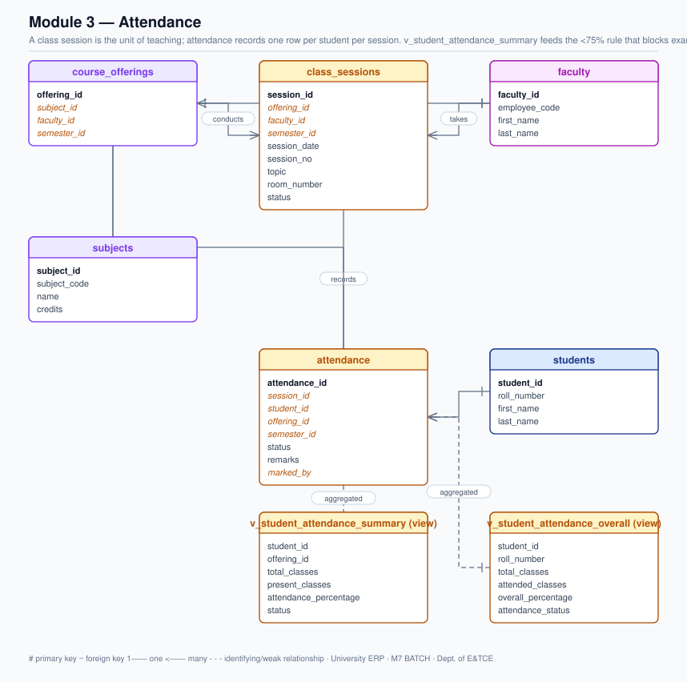

_A class session is the unit of teaching; attendance records one row per student per session. v_student_attendance_summary feeds the <75% rule that blocks exam registration._

<details><summary>Mermaid source (paste into any Mermaid renderer)</summary>

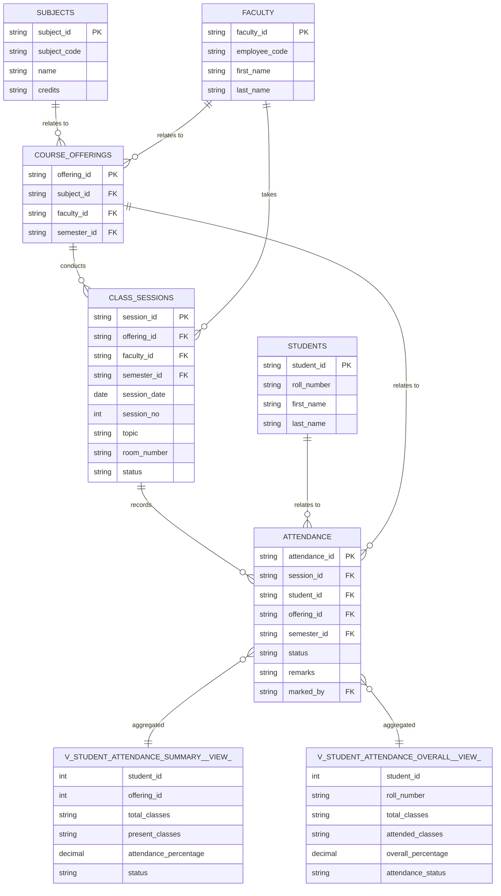
```mermaid
erDiagram
    COURSE_OFFERINGS {
        string offering_id PK
        string subject_id FK
        string faculty_id FK
        string semester_id FK
    }
    SUBJECTS {
        string subject_id PK
        string subject_code
        string name
        string credits
    }
    CLASS_SESSIONS {
        string session_id PK
        string offering_id FK
        string faculty_id FK
        string semester_id FK
        date session_date
        int session_no
        string topic
        string room_number
        string status
    }
    ATTENDANCE {
        string attendance_id PK
        string session_id FK
        string student_id FK
        string offering_id FK
        string semester_id FK
        string status
        string remarks
        string marked_by FK
    }
    STUDENTS {
        string student_id PK
        string roll_number
        string first_name
        string last_name
    }
    FACULTY {
        string faculty_id PK
        string employee_code
        string first_name
        string last_name
    }
    V_STUDENT_ATTENDANCE_SUMMARY__VIEW_ {
        int student_id
        int offering_id
        string total_classes
        string present_classes
        decimal attendance_percentage
        string status
    }
    V_STUDENT_ATTENDANCE_OVERALL__VIEW_ {
        int student_id
        string roll_number
        string total_classes
        string attended_classes
        decimal overall_percentage
        string attendance_status
    }
    SUBJECTS ||--o{ COURSE_OFFERINGS : "relates to"
    FACULTY ||--o{ COURSE_OFFERINGS : "relates to"
    COURSE_OFFERINGS ||--o{ CLASS_SESSIONS : "conducts"
    FACULTY ||--o{ CLASS_SESSIONS : "takes"
    CLASS_SESSIONS ||--o{ ATTENDANCE : "records"
    STUDENTS ||--o{ ATTENDANCE : "relates to"
    COURSE_OFFERINGS ||--o{ ATTENDANCE : "relates to"
    ATTENDANCE }o--|| V_STUDENT_ATTENDANCE_SUMMARY__VIEW_ : "aggregated"
    ATTENDANCE }o--|| V_STUDENT_ATTENDANCE_OVERALL__VIEW_ : "aggregated"
```
</details>

## Module 4 — Examination & Results

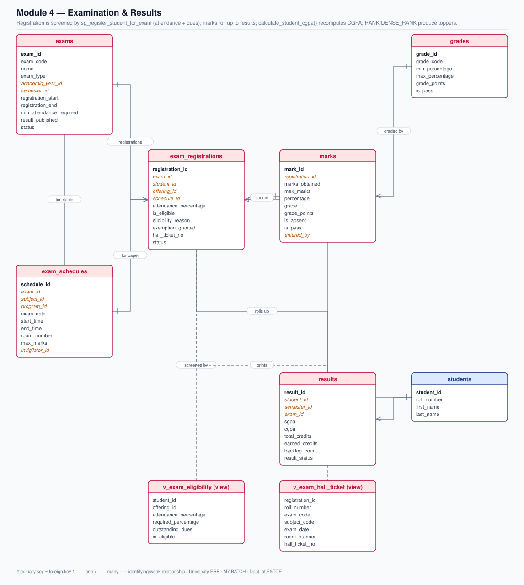

_Registration is screened by sp_register_student_for_exam (attendance + dues); marks roll up to results; calculate_student_cgpa() recomputes CGPA; RANK/DENSE_RANK produce toppers._

<details><summary>Mermaid source (paste into any Mermaid renderer)</summary>

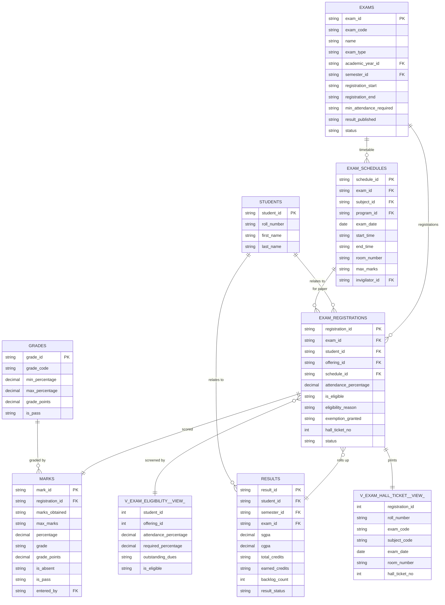
```mermaid
erDiagram
    EXAMS {
        string exam_id PK
        string exam_code
        string name
        string exam_type
        string academic_year_id FK
        string semester_id FK
        string registration_start
        string registration_end
        string min_attendance_required
        string result_published
        string status
    }
    EXAM_SCHEDULES {
        string schedule_id PK
        string exam_id FK
        string subject_id FK
        string program_id FK
        date exam_date
        string start_time
        string end_time
        string room_number
        string max_marks
        string invigilator_id FK
    }
    EXAM_REGISTRATIONS {
        string registration_id PK
        string exam_id FK
        string student_id FK
        string offering_id FK
        string schedule_id FK
        decimal attendance_percentage
        string is_eligible
        string eligibility_reason
        string exemption_granted
        int hall_ticket_no
        string status
    }
    MARKS {
        string mark_id PK
        string registration_id FK
        string marks_obtained
        string max_marks
        decimal percentage
        string grade
        decimal grade_points
        string is_absent
        string is_pass
        string entered_by FK
    }
    GRADES {
        string grade_id PK
        string grade_code
        decimal min_percentage
        decimal max_percentage
        decimal grade_points
        string is_pass
    }
    RESULTS {
        string result_id PK
        string student_id FK
        string semester_id FK
        string exam_id FK
        decimal sgpa
        decimal cgpa
        string total_credits
        string earned_credits
        int backlog_count
        string result_status
    }
    STUDENTS {
        string student_id PK
        string roll_number
        string first_name
        string last_name
    }
    V_EXAM_ELIGIBILITY__VIEW_ {
        int student_id
        int offering_id
        decimal attendance_percentage
        decimal required_percentage
        string outstanding_dues
        string is_eligible
    }
    V_EXAM_HALL_TICKET__VIEW_ {
        int registration_id
        string roll_number
        string exam_code
        string subject_code
        date exam_date
        string room_number
        int hall_ticket_no
    }
    EXAMS ||--o{ EXAM_SCHEDULES : "timetable"
    EXAMS ||--o{ EXAM_REGISTRATIONS : "registrations"
    STUDENTS ||--o{ EXAM_REGISTRATIONS : "relates to"
    EXAM_SCHEDULES ||--o{ EXAM_REGISTRATIONS : "for paper"
    EXAM_REGISTRATIONS ||--|| MARKS : "scored"
    GRADES ||--o{ MARKS : "graded by"
    EXAM_REGISTRATIONS }o--|| RESULTS : "rolls up"
    STUDENTS ||--o{ RESULTS : "relates to"
    EXAM_REGISTRATIONS }o--|| V_EXAM_ELIGIBILITY__VIEW_ : "screened by"
    EXAM_REGISTRATIONS ||--|| V_EXAM_HALL_TICKET__VIEW_ : "prints"
```
</details>

## Module 5 — Fees & Finance

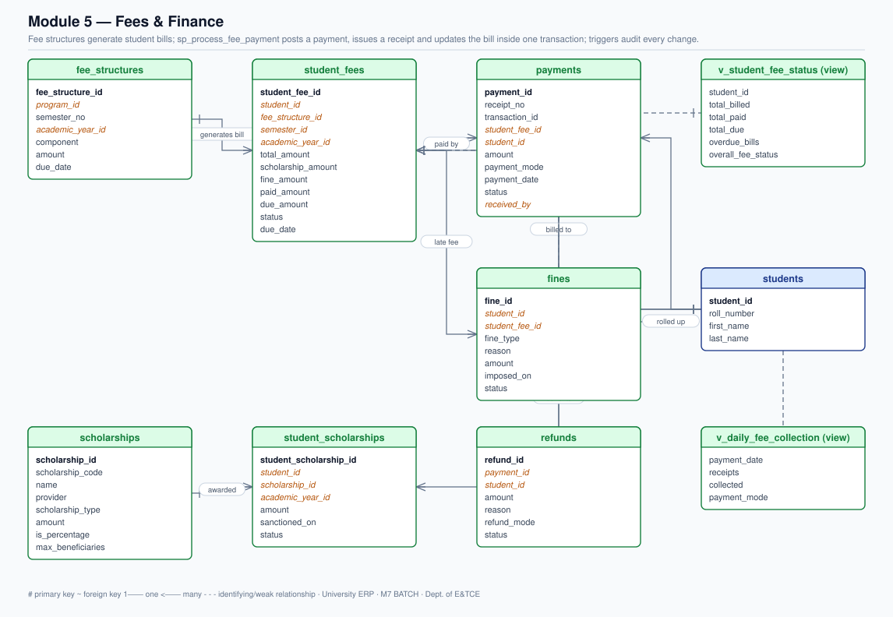

_Fee structures generate student bills; sp_process_fee_payment posts a payment, issues a receipt and updates the bill inside one transaction; triggers audit every change._

<details><summary>Mermaid source (paste into any Mermaid renderer)</summary>

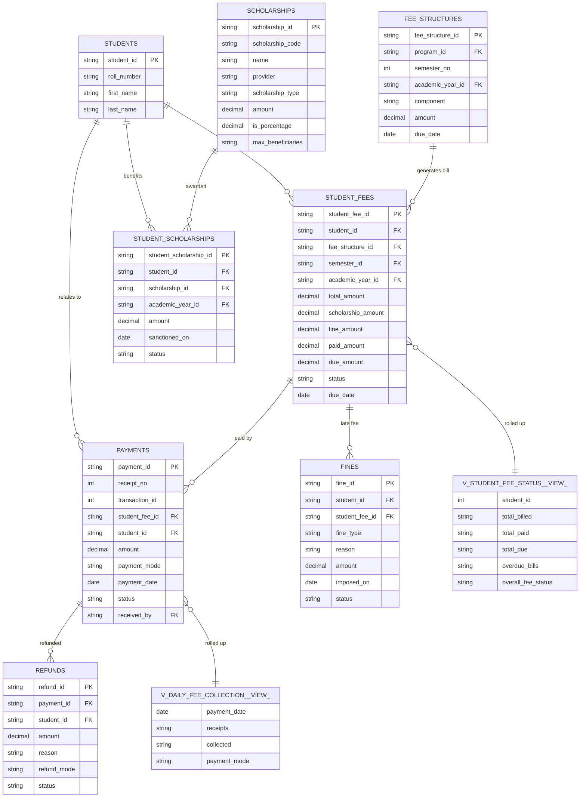
```mermaid
erDiagram
    FEE_STRUCTURES {
        string fee_structure_id PK
        string program_id FK
        int semester_no
        string academic_year_id FK
        string component
        decimal amount
        date due_date
    }
    STUDENT_FEES {
        string student_fee_id PK
        string student_id FK
        string fee_structure_id FK
        string semester_id FK
        string academic_year_id FK
        decimal total_amount
        decimal scholarship_amount
        decimal fine_amount
        decimal paid_amount
        decimal due_amount
        string status
        date due_date
    }
    PAYMENTS {
        string payment_id PK
        int receipt_no
        int transaction_id
        string student_fee_id FK
        string student_id FK
        decimal amount
        string payment_mode
        date payment_date
        string status
        string received_by FK
    }
    FINES {
        string fine_id PK
        string student_id FK
        string student_fee_id FK
        string fine_type
        string reason
        decimal amount
        date imposed_on
        string status
    }
    REFUNDS {
        string refund_id PK
        string payment_id FK
        string student_id FK
        decimal amount
        string reason
        string refund_mode
        string status
    }
    SCHOLARSHIPS {
        string scholarship_id PK
        string scholarship_code
        string name
        string provider
        string scholarship_type
        decimal amount
        decimal is_percentage
        string max_beneficiaries
    }
    STUDENT_SCHOLARSHIPS {
        string student_scholarship_id PK
        string student_id FK
        string scholarship_id FK
        string academic_year_id FK
        decimal amount
        date sanctioned_on
        string status
    }
    STUDENTS {
        string student_id PK
        string roll_number
        string first_name
        string last_name
    }
    V_STUDENT_FEE_STATUS__VIEW_ {
        int student_id
        string total_billed
        string total_paid
        string total_due
        string overdue_bills
        string overall_fee_status
    }
    V_DAILY_FEE_COLLECTION__VIEW_ {
        date payment_date
        string receipts
        string collected
        string payment_mode
    }
    FEE_STRUCTURES ||--o{ STUDENT_FEES : "generates bill"
    STUDENTS ||--o{ STUDENT_FEES : "billed to"
    STUDENT_FEES ||--o{ PAYMENTS : "paid by"
    STUDENTS ||--o{ PAYMENTS : "relates to"
    STUDENT_FEES ||--o{ FINES : "late fee"
    PAYMENTS ||--o{ REFUNDS : "refunded"
    SCHOLARSHIPS ||--o{ STUDENT_SCHOLARSHIPS : "awarded"
    STUDENTS ||--o{ STUDENT_SCHOLARSHIPS : "benefits"
    STUDENT_FEES }o--|| V_STUDENT_FEE_STATUS__VIEW_ : "rolled up"
    PAYMENTS }o--|| V_DAILY_FEE_COLLECTION__VIEW_ : "rolled up"
```
</details>

## Module 6 — Hostel

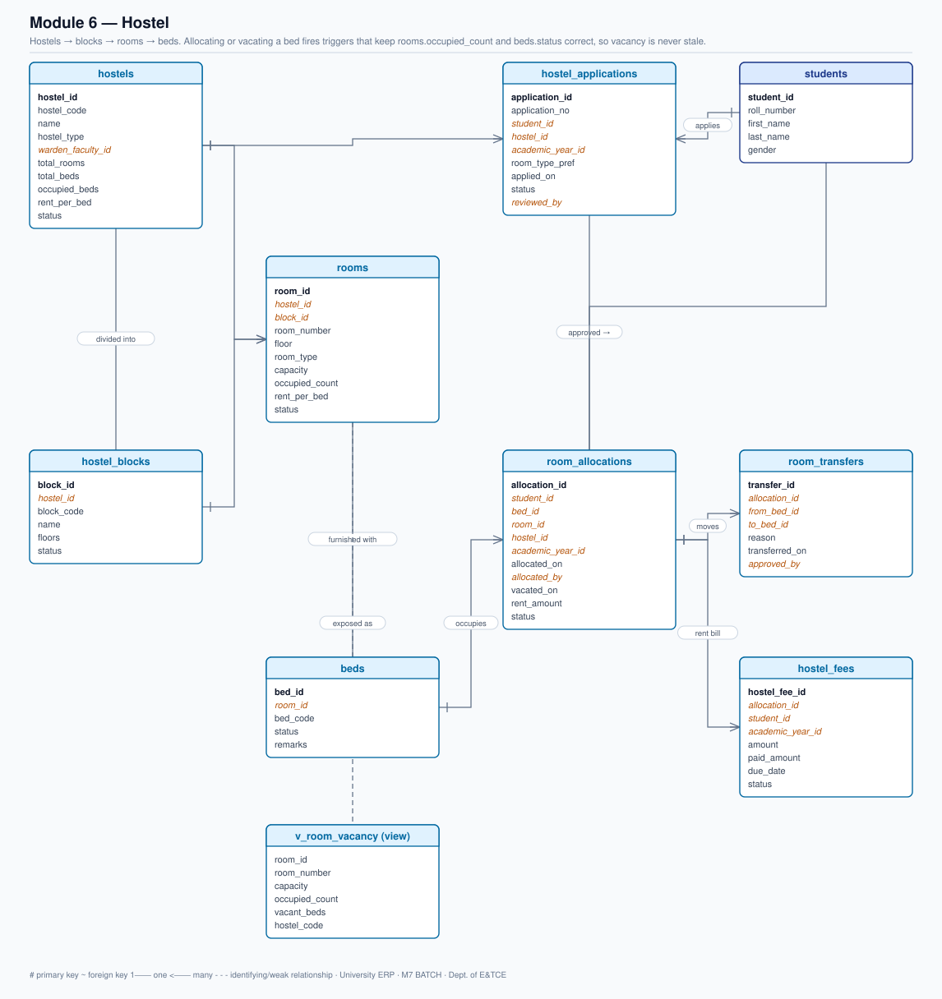

_Hostels → blocks → rooms → beds. Allocating or vacating a bed fires triggers that keep rooms.occupied_count and beds.status correct, so vacancy is never stale._

<details><summary>Mermaid source (paste into any Mermaid renderer)</summary>

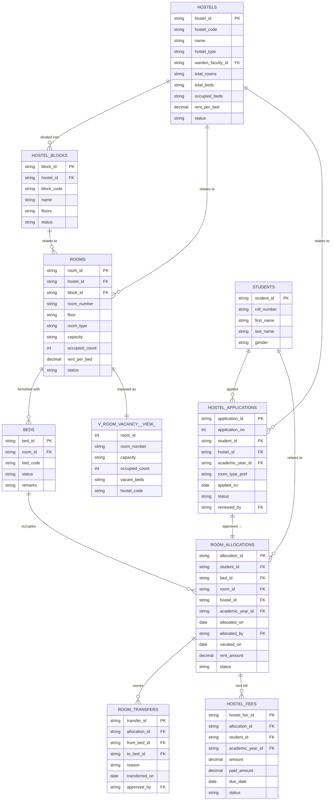
```mermaid
erDiagram
    HOSTELS {
        string hostel_id PK
        string hostel_code
        string name
        string hostel_type
        string warden_faculty_id FK
        string total_rooms
        string total_beds
        string occupied_beds
        decimal rent_per_bed
        string status
    }
    HOSTEL_BLOCKS {
        string block_id PK
        string hostel_id FK
        string block_code
        string name
        string floors
        string status
    }
    ROOMS {
        string room_id PK
        string hostel_id FK
        string block_id FK
        string room_number
        string floor
        string room_type
        string capacity
        int occupied_count
        decimal rent_per_bed
        string status
    }
    BEDS {
        string bed_id PK
        string room_id FK
        string bed_code
        string status
        string remarks
    }
    HOSTEL_APPLICATIONS {
        string application_id PK
        int application_no
        string student_id FK
        string hostel_id FK
        string academic_year_id FK
        string room_type_pref
        date applied_on
        string status
        string reviewed_by FK
    }
    ROOM_ALLOCATIONS {
        string allocation_id PK
        string student_id FK
        string bed_id FK
        string room_id FK
        string hostel_id FK
        string academic_year_id FK
        date allocated_on
        string allocated_by FK
        date vacated_on
        decimal rent_amount
        string status
    }
    ROOM_TRANSFERS {
        string transfer_id PK
        string allocation_id FK
        string from_bed_id FK
        string to_bed_id FK
        string reason
        date transferred_on
        string approved_by FK
    }
    HOSTEL_FEES {
        string hostel_fee_id PK
        string allocation_id FK
        string student_id FK
        string academic_year_id FK
        decimal amount
        decimal paid_amount
        date due_date
        string status
    }
    STUDENTS {
        string student_id PK
        string roll_number
        string first_name
        string last_name
        string gender
    }
    V_ROOM_VACANCY__VIEW_ {
        int room_id
        string room_number
        string capacity
        int occupied_count
        string vacant_beds
        string hostel_code
    }
    HOSTELS ||--o{ HOSTEL_BLOCKS : "divided into"
    HOSTELS ||--o{ ROOMS : "relates to"
    HOSTEL_BLOCKS ||--o{ ROOMS : "relates to"
    ROOMS ||--o{ BEDS : "furnished with"
    STUDENTS ||--o{ HOSTEL_APPLICATIONS : "applies"
    HOSTELS ||--o{ HOSTEL_APPLICATIONS : "relates to"
    HOSTEL_APPLICATIONS ||--|| ROOM_ALLOCATIONS : "approved →"
    BEDS ||--o{ ROOM_ALLOCATIONS : "occupies"
    STUDENTS ||--o{ ROOM_ALLOCATIONS : "relates to"
    ROOM_ALLOCATIONS ||--o{ ROOM_TRANSFERS : "moves"
    ROOM_ALLOCATIONS ||--o{ HOSTEL_FEES : "rent bill"
    ROOMS ||--|| V_ROOM_VACANCY__VIEW_ : "exposed as"
```
</details>

## Module 7 — Faculty, Leave & Payroll

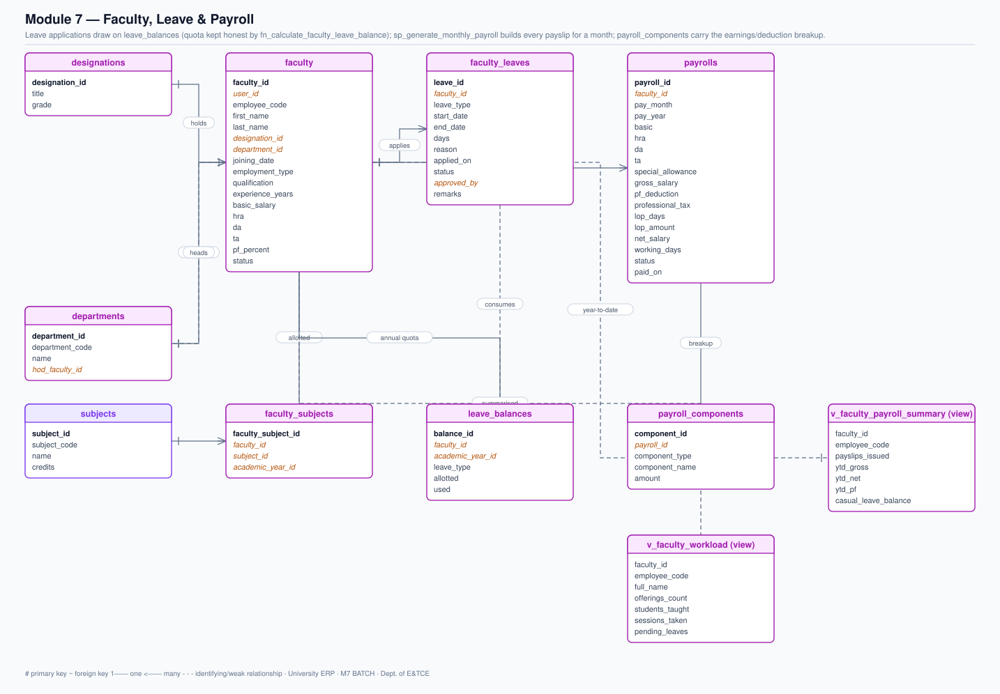

_Leave applications draw on leave_balances (quota kept honest by fn_calculate_faculty_leave_balance); sp_generate_monthly_payroll builds every payslip for a month; payroll_components carry the earnings/deduction breakup._

<details><summary>Mermaid source (paste into any Mermaid renderer)</summary>

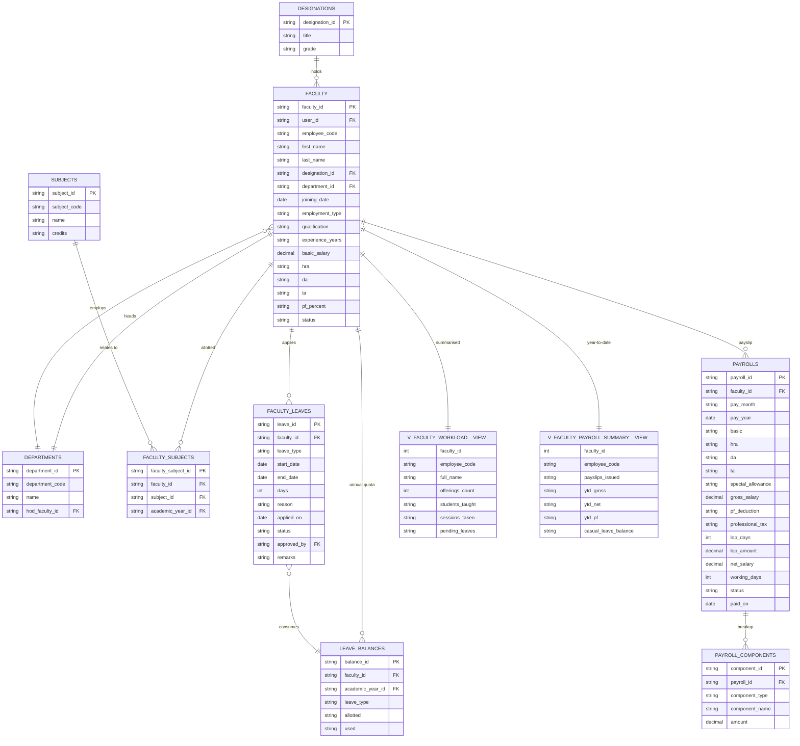
```mermaid
erDiagram
    DESIGNATIONS {
        string designation_id PK
        string title
        string grade
    }
    DEPARTMENTS {
        string department_id PK
        string department_code
        string name
        string hod_faculty_id FK
    }
    FACULTY {
        string faculty_id PK
        string user_id FK
        string employee_code
        string first_name
        string last_name
        string designation_id FK
        string department_id FK
        date joining_date
        string employment_type
        string qualification
        string experience_years
        decimal basic_salary
        string hra
        string da
        string ta
        string pf_percent
        string status
    }
    FACULTY_SUBJECTS {
        string faculty_subject_id PK
        string faculty_id FK
        string subject_id FK
        string academic_year_id FK
    }
    SUBJECTS {
        string subject_id PK
        string subject_code
        string name
        string credits
    }
    FACULTY_LEAVES {
        string leave_id PK
        string faculty_id FK
        string leave_type
        date start_date
        date end_date
        int days
        string reason
        date applied_on
        string status
        string approved_by FK
        string remarks
    }
    LEAVE_BALANCES {
        string balance_id PK
        string faculty_id FK
        string academic_year_id FK
        string leave_type
        string allotted
        string used
    }
    PAYROLLS {
        string payroll_id PK
        string faculty_id FK
        string pay_month
        date pay_year
        string basic
        string hra
        string da
        string ta
        string special_allowance
        decimal gross_salary
        string pf_deduction
        string professional_tax
        int lop_days
        decimal lop_amount
        decimal net_salary
        int working_days
        string status
        date paid_on
    }
    PAYROLL_COMPONENTS {
        string component_id PK
        string payroll_id FK
        string component_type
        string component_name
        decimal amount
    }
    V_FACULTY_WORKLOAD__VIEW_ {
        int faculty_id
        string employee_code
        string full_name
        int offerings_count
        string students_taught
        string sessions_taken
        string pending_leaves
    }
    V_FACULTY_PAYROLL_SUMMARY__VIEW_ {
        int faculty_id
        string employee_code
        string payslips_issued
        string ytd_gross
        string ytd_net
        string ytd_pf
        string casual_leave_balance
    }
    DESIGNATIONS ||--o{ FACULTY : "holds"
    DEPARTMENTS ||--o{ FACULTY : "employs"
    FACULTY ||--|| DEPARTMENTS : "heads"
    FACULTY ||--o{ FACULTY_SUBJECTS : "allotted"
    SUBJECTS ||--o{ FACULTY_SUBJECTS : "relates to"
    FACULTY ||--o{ FACULTY_LEAVES : "applies"
    FACULTY ||--o{ LEAVE_BALANCES : "annual quota"
    FACULTY_LEAVES }o--|| LEAVE_BALANCES : "consumes"
    FACULTY ||--o{ PAYROLLS : "payslip"
    PAYROLLS ||--o{ PAYROLL_COMPONENTS : "breakup"
    FACULTY ||--|| V_FACULTY_WORKLOAD__VIEW_ : "summarised"
    FACULTY ||--|| V_FACULTY_PAYROLL_SUMMARY__VIEW_ : "year-to-date"
```
</details>

